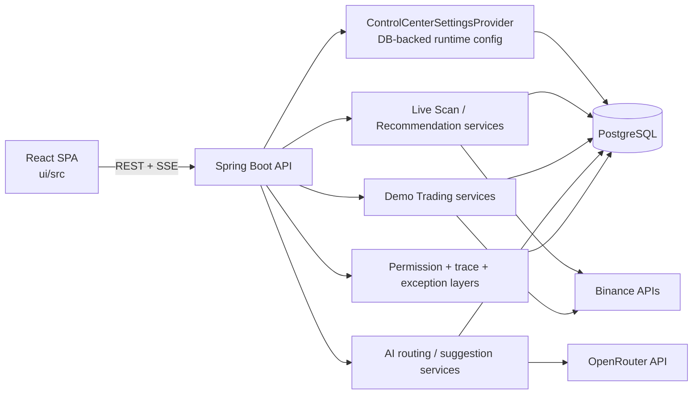

# PROJECT MASTER DOCUMENT

## 1. Executive Overview
TradeBot, branded in the repository as `TradeBot Auto-Scanner` in `README.md` and `TradeBot` in `ui/src/App.tsx`, is a local operator-facing trading analysis platform built from a Spring Boot backend and a React frontend. [Confirmed]

- Project name: TradeBot / TradeBot Auto-Scanner. [Confirmed]
- Project type: Modular-monolith backend plus single-page web UI. [Confirmed]
- Main purpose: Scan Binance perpetual futures markets for Smart Money / Fibonacci sweep-continuation setups, surface manual order instructions, simulate demo trading, and generate AI-assisted strategy tuning suggestions from accumulated feedback. [Confirmed]
- Target users: A technically capable local operator or trader managing the system directly from localhost rather than a multi-user SaaS audience. [Inferred from localhost-only mutation guards, local startup scripts, and absence of user auth]
- Business problem solved: Reduce manual chart scanning, centralize setup review and replay, provide a safer paper-trading loop, and shorten the feedback cycle for tuning strategy parameters. [Confirmed from implemented features; business framing is Inferred]
- Current maturity: Feature-rich internal tool / late MVP with meaningful implementation depth, but not production-ready. [Inferred]
- Production-readiness judgment: Not production-ready in its current state because the repository contains committed secrets, operator permissions are global runtime toggles rather than per-user authorization, and both backend and frontend test suites are materially out of sync with the codebase. [Confirmed]

## 2. High-Level Project Summary
### One-paragraph summary
TradeBot is a locally run trading workstation that continuously or manually scans Binance futures symbols, evaluates them against a strict structural setup model, stores telemetry for replay and diagnostics, presents recommended manual order payloads, runs an isolated demo-trading loop against market data, and uses OpenRouter-hosted LLMs to propose strategy parameter changes after enough trade feedback has accumulated. [Confirmed]

### Detailed summary
The project combines four substantive subsystems. First, a live scan pipeline ranks a top-volume symbol universe, evaluates each symbol using bias, impulse-leg, Fibonacci, sweep/reclaim, and risk-sizing logic, then persists scan telemetry, symbol evaluations, and a best recommendation. Second, a DB-first Control Center stores runtime permissions and behavior in PostgreSQL and feeds that configuration back into scanners, risk logic, alerts, AI routing, and demo-trading behavior. Third, a demo-trading subsystem uses live market data but keeps its own `demo_*` tables, lifecycle, analytics, and AI suggestion loop so that paper trading does not contaminate live records. Fourth, an AI layer routes requests through allowlisted OpenRouter models for suggestion generation and diagnostics, records call/audit data, and allows a human operator to accept or reject proposed parameter changes. [Confirmed]

### Technical summary
The backend is a Spring Boot 3.2.4 application on Java 21 with Spring MVC controllers, WebFlux clients for upstream APIs, JPA/Hibernate persistence, Flyway SQL migrations, scheduled jobs for live and demo loops, SSE for live scan streaming, and a centralized `ControlCenterSettingsProvider` for DB-backed runtime configuration. The frontend is a React 19 / Vite 7 SPA using React Router, Axios, Zustand, Tailwind, Recharts, Framer Motion, and custom hooks for SSE, polling, and control-center state. PostgreSQL stores both canonical runtime config and all scan, recommendation, feedback, AI audit, and demo-trading data. [Confirmed]

### Business summary
The system appears intended to give a single operator a faster and more disciplined trading workflow: find opportunities, inspect why they were or were not valid, manually place trades with preflight guidance, log outcomes, observe simulated demo performance, and periodically review AI-generated suggestions before changing strategy parameters. The implemented behavior is consistent with a learning or internal research platform rather than an automated production trading engine. [Inferred from feature set and explicit manual-placement UX]

## 3. Repository / Project Structure
### Structural overview
The repository is split into a backend application under `src/main/java`, database and runtime resources under `src/main/resources`, backend tests under `src/test/java`, and a separate frontend project under `ui/`. The architectural center of gravity is the backend, especially `controlcenter`, `service`, `demo/service`, and `controller`, while the UI consumes those APIs and mirrors the backend runtime model rather than owning business logic. [Confirmed]

### Separation of concerns
- Main logic lives in `src/main/java/com/tradebot/service` for live trading/scanning behavior and `src/main/java/com/tradebot/demo/service` for demo runtime behavior. [Confirmed]
- UI lives in `ui/src/pages`, `ui/src/components`, `ui/src/hooks`, and `ui/src/api`. [Confirmed]
- Backend/service boundaries live primarily across `controller`, `service`, `demo/service`, `controlcenter`, `ai`, and `client`. [Confirmed]
- Configuration lives in `src/main/resources/application*.yml`, config property classes under `src/main/java/com/tradebot/config`, and DB-backed runtime state in `control_center_state`. [Confirmed]
- Tests live in `src/test/java` for backend and `ui/src/**/*.test.ts(x)` for frontend. [Confirmed]
- Assets are minimal; identified assets live in `ui/src/assets` and `ui/public`. No backend media or binary asset pipeline was identified. [Confirmed]

| Path | Role | Importance | Notes |
| --- | --- | --- | --- |
| `README.md` | Primary human-facing project overview | High | Documents local quick start and DB-first runtime model. |
| `build.gradle.kts` | Backend build, dependency, and Java version definition | High | Confirms Spring Boot 3.2.4 and Java 21. |
| `start-all.sh` | Local dev bootstrap script | High | Checks local Postgres, starts backend, installs frontend deps, launches Vite. |
| `stop-all.sh` | Local shutdown helper | Medium | Uses broad `pkill` patterns for Vite/Java/Gradle. |
| `docker-compose.yml` | Optional local PostgreSQL runtime | High | Defines a Postgres 15 container with default DB credentials. |
| `src/main/java/com/tradebot/TradeBotApplication.java` | Backend entry point | High | Enables scheduling and configuration properties scanning. |
| `src/main/java/com/tradebot/controller` | Live/runtime HTTP API controllers | High | Contains scan, recommendation, settings, AI, export, and status endpoints. |
| `src/main/java/com/tradebot/controlcenter` | Canonical runtime configuration layer | High | DB-backed control-center config, permission catalog shaping, patching, caching. |
| `src/main/java/com/tradebot/service` | Core live application services | High | Scan orchestration, query services, placeability, explainability, AI suggestions. |
| `src/main/java/com/tradebot/demo` | Demo trading subsystem | High | Isolated controllers, DTOs, entities, repositories, and services. |
| `src/main/java/com/tradebot/ai` | AI routing and model fallback behavior | High | OpenRouter model routing and retry chain logic. |
| `src/main/java/com/tradebot/client` | Upstream API clients | High | Binance and OpenRouter integration points. |
| `src/main/java/com/tradebot/operator` | Runtime permission model | High | Interceptor, permission catalog, permission update endpoints. |
| `src/main/java/com/tradebot/security` | Local mutation guard and related checks | High | Restricts mutation endpoints to loopback/local origins. |
| `src/main/java/com/tradebot/sse` | Live scan event streaming | High | SSE stream registry, event publisher, replay/heartbeat support. |
| `src/main/java/com/tradebot/entity` | Live persistence model | High | JPA entities for scans, recommendations, control center, AI, feedback. |
| `src/main/java/com/tradebot/demo/entity` | Demo persistence model | High | JPA entities for demo account, trades, runs, analytics, AI. |
| `src/main/resources/application.yml.example` | Safe config template | High | Minimal non-secret example for local setup. |
| `src/main/resources/application.yml` | Active backend config in repo | Critical | Contains live-looking secrets and DB credentials; confirmed security issue. |
| `src/main/resources/db/migration` | Flyway SQL migrations | Critical | Canonical database schema history from `V1` through `V28`. |
| `src/test/java` | Backend tests | High | Broad coverage intent, but current suite does not compile. |
| `ui/package.json` | Frontend dependency and script manifest | High | Confirms React/Vite/Tailwind/Vitest stack. |
| `ui/src/App.tsx` | Frontend app shell and route map | High | Confirms page structure and global providers. |
| `ui/src/api` | Frontend API contracts and HTTP calls | High | Mirrors backend routes; useful for identifying drift. |
| `ui/src/pages` | Screen-level UI modules | High | Dashboard, scan, replay, journal, AI, demo, control-center, errors. |
| `ui/src/store` | Frontend client-side state | High | Error, toast, alerts, and journal stores. |
| `docs/RUNBOOK.md` | Most substantive operations doc | Medium | Supports DB-first runtime model claims. |
| `docs/SECURITY.md` | Basic security notes | Medium | Thin but relevant guidance around keys/logs. |
| `docs/TROUBLESHOOTING.md` | Basic ops troubleshooting | Medium | Documents expected failure modes and local fixes. |
| `docs/architecture.md` | Architecture doc placeholder | Medium | Present but not authoritative; mostly stub text. |
| `docs/product-design.md` | Product doc placeholder | Medium | Present but not authoritative; mostly stub text. |
| `docs/dev-setup.md` | Dev-setup doc placeholder | Medium | Present but not authoritative; mostly stub text. |
| `scripts/smoke-*.sh` | Manual smoke validation scripts | Medium | Verify API behavior and structured error envelopes. |

## 4. Technology Stack
The stack is directly observable from `build.gradle.kts`, `ui/package.json`, config classes under `src/main/java/com/tradebot/config`, and runtime manifests such as `docker-compose.yml`. Conventional authentication, CI/CD, and deployment orchestration beyond local Docker/Postgres were not identified. [Confirmed]

| Layer | Technology | Version | Purpose | Evidence |
| --- | --- | --- | --- | --- |
| Backend language | Java | 21 | Main backend implementation language | `build.gradle.kts` |
| Backend framework | Spring Boot | 3.2.4 | Application framework and dependency BOM | `build.gradle.kts` |
| Dependency management | Spring dependency-management plugin | 1.1.4 | Gradle dependency alignment | `build.gradle.kts` |
| Web API | `spring-boot-starter-web` | Spring-managed | REST controllers / MVC | `build.gradle.kts` |
| HTTP clients / reactive support | `spring-boot-starter-webflux` | Spring-managed | WebClient for Binance/OpenRouter calls | `build.gradle.kts`, `client/*` |
| Validation | `spring-boot-starter-validation` | Spring-managed | DTO validation | `build.gradle.kts`, DTO annotations |
| Persistence | Spring Data JPA / Hibernate | Spring-managed | ORM and repositories | `build.gradle.kts`, `entity/*`, `repository/*` |
| Database migrations | Flyway | Spring-managed | Versioned SQL schema migrations | `build.gradle.kts`, `src/main/resources/db/migration/*` |
| Database engine | PostgreSQL | 15-alpine in local compose | Primary relational store | `docker-compose.yml`, JDBC config |
| Metrics | Micrometer Prometheus registry | Spring-managed | Metrics export capability | `build.gradle.kts` |
| Resilience | Resilience4j Spring Boot 3 | 2.2.0 | Upstream resilience support | `build.gradle.kts` |
| JSON / mapping | Jackson | Spring-managed | DTO and JSONB serialization | `build.gradle.kts`, ObjectMapper usage |
| Boilerplate reduction | Lombok | Version not pinned in file | Getters/setters/data classes | `build.gradle.kts`, many entities/DTOs |
| Frontend language | TypeScript | ~5.9.3 | Type-safe frontend code | `ui/package.json` |
| Frontend framework | React | ^19.2.0 | SPA UI layer | `ui/package.json` |
| Frontend router | React Router DOM | ^7.13.1 | Client-side routing | `ui/package.json`, `ui/src/App.tsx` |
| HTTP client | Axios | ^1.13.6 | Browser API requests | `ui/package.json`, `ui/src/api/axiosSetup.ts` |
| Client state | Zustand | ^5.0.11 | Lightweight client stores | `ui/package.json`, `ui/src/store/*` |
| Data viz | Recharts | ^3.7.0 | Demo analytics / scan charts | `ui/package.json`, `ui/src/pages/DemoTradingPage.tsx` |
| Motion | Framer Motion | ^12.34.3 | Demo page animation/polish | `ui/package.json`, `ui/src/pages/DemoTradingPage.tsx` |
| Virtualization | `@tanstack/react-virtual` | ^3.13.19 | Large table virtualization on demo page | `ui/package.json`, `ui/src/pages/DemoTradingPage.tsx` |
| UI styling | Tailwind CSS | ^3.4.19 | Utility-first styling | `ui/package.json`, `ui/tailwind.config.js` |
| Frontend bundler | Vite | ^7.3.1 | Dev server and production bundling | `ui/package.json`, `ui/vite.config.ts` |
| Frontend test runner | Vitest | ^3.2.4 | Frontend test execution | `ui/package.json`, `ui/vitest.config.ts` |
| Frontend test libs | Testing Library + jsdom | various | Component and hook tests | `ui/package.json`, `ui/src/test/setup.ts` |
| Frontend linting | ESLint | ^9.39.1 | Static linting | `ui/package.json`, `ui/eslint.config.js` |
| Package managers | Gradle wrapper, npm | Wrapper / lockfile managed | Backend and frontend dependency execution | `gradlew`, `ui/package-lock.json` |
| Local infrastructure | Docker Compose | Compose schema 3.8 | Optional local Postgres runtime | `docker-compose.yml` |
| Authentication approach | No conventional auth identified | N/A | Global runtime permission flags plus localhost mutation guard | `operator/*`, `security/LocalMutationGuard.java` |
| CI/CD tools | Not identified | Not identified | No workflow or pipeline config found in repo | Repository inspection |

## 5. Architecture
### Architecture style
The implemented system is a modular monolith: one Spring Boot application contains multiple internal domains, and one React SPA consumes its APIs. There is no microservice decomposition, no separate worker service, and no separate auth service. [Confirmed]

### Client-server boundaries
- Frontend boundary: React SPA under `ui/src` is responsible for routing, presentation, client-side polling/SSE subscriptions, and a few local-only stores (`journalStore`, `errorStore`, `alertsStore`, `toastStore`). [Confirmed]
- Backend boundary: Spring Boot owns all business logic, persistence, runtime config, scheduling, upstream API integration, and permission enforcement. [Confirmed]
- External boundaries: Binance is used for exchange info, mark prices, tick sizes, tickers, and klines; OpenRouter is used for LLM completions. [Confirmed]

### Architectural narrative
The backend centers on `ControlCenterSettingsProvider`, which loads the canonical runtime config from the single-row `control_center_state` table, normalizes it, enforces invariants, and exposes typed views of scan settings, risk settings, AI routing, demo settings, and permissions. Live scan and demo-trading services consult that provider rather than reading static YAML for runtime behavior. The frontend mirrors this model through `/api/v1/control-center/state` and treats the control-center payload as the primary UI configuration state. [Confirmed]

The live scan path starts in `ScanOrchestrator`, which runs either on demand or from a scheduled loop. It selects a top-volume symbol universe from Binance, evaluates each symbol with a multi-step technical pipeline, persists telemetry and evaluations, streams progress over SSE, and writes the winning recommendation plus order payloads. Query-side services such as `ScanQueryService`, `RecommendationQueryService`, `RecommendationPlaceabilityService`, and `ExplainabilityService` then serve summaries, replays, detail views, and manual-placement checks. [Confirmed]

The demo path is intentionally isolated. `DemoTradingScheduler`, `DemoOrchestrator`, `DemoTradeMonitor`, `DemoAnalyticsService`, and related repositories all operate on `demo_*` tables. Demo mode uses real market data but never places real orders. AI suggestion logic exists in both live and demo variants, with separate config version tables, separate call logs, and separate batch tables. [Confirmed]

### Request/response lifecycle
1. The browser or smoke script sends a request, usually with `X-Trace-Id`; Axios adds one if absent in `ui/src/api/axiosSetup.ts`. [Confirmed]
2. `TraceIdFilter` resolves or creates a trace id, sets the `X-Trace-Id` response header, and puts the value in MDC. [Confirmed]
3. `WebConfig` applies local CORS policy for `/api/**`; `OperatorPermissionInterceptor` checks `@RequiresPermission` annotations before the controller runs. [Confirmed]
4. Mutating local-only endpoints call `LocalMutationGuard.assertLocal()` inside controllers to require loopback remote address and localhost origin/header conditions. [Confirmed]
5. Controllers delegate to services; services call repositories, runtime config providers, and upstream clients. [Confirmed]
6. Exceptions are mapped into a consistent JSON error envelope by `GlobalExceptionHandler`, which preserves `traceId`, `path`, `errorCode`, `message`, and `details`. [Confirmed]
7. For live scan streaming, `ScanEventPublisher` writes events into `ScanEventStream`; `ScanController` exposes those events through `SseEmitter` with heartbeat and replay support. [Confirmed]

### Scheduled/background execution
- Live autoscan: `ScanOrchestrator.runScheduled()` runs every 15 seconds after a 10 second initial delay, but only starts a scan when `scan.autoscanEnabled=true` and `safeMode=false`. [Confirmed]
- Demo cycle loop: `DemoTradingScheduler.scheduledCycleTick()` runs every 15 seconds and checks whether the configured interval has elapsed. [Confirmed]
- Demo monitor loop: `DemoTradingScheduler.scheduledMonitorTick()` runs every 5 seconds to manage open demo trades. [Confirmed]
- AI suggestion generation: live suggestion generation is event-like rather than scheduled; it is triggered after feedback saves when total feedback count reaches a multiple of 10. Demo suggestion generation is tied to demo trade closure milestones. [Confirmed]

### State management
- Backend runtime state: PostgreSQL-backed via `control_center_state` plus domain tables. [Confirmed]
- Frontend runtime state: React component state, `PermissionsProvider` context, Zustand stores for alerts/errors/toasts, and localStorage-backed journal/alert persistence. [Confirmed]

### Dependency flow
- Controllers depend on services. [Confirmed]
- Services depend on repositories, config providers, and upstream clients. [Confirmed]
- `ControlCenterSettingsProvider` is an inward dependency for scan, AI, settings, and demo modules. [Confirmed]
- UI pages depend on hooks and API clients; hooks depend on API utilities and client-side stores. [Confirmed]



## 6. Functional Scope
The table below lists discovered capabilities. Status is labeled conservatively: `Confirmed` means directly implemented in code; `Inferred` means the business intent is strongly suggested by code but not explicitly stated as a product requirement.

| Feature | What it does | Files/Modules | Status (Confirmed/Inferred) | Notes |
| --- | --- | --- | --- | --- |
| Live scan orchestration | Runs market scans, persists telemetry, emits SSE, and creates recommendations | `service/ScanOrchestrator.java`, `controller/ScanController.java` | Confirmed | Core live workflow |
| Autoscan scheduling | Periodically attempts scheduled scans with dedup and stale-run recovery | `service/ScanOrchestrator.java`, `service/AutoScanStateService.java` | Confirmed | Depends on control-center scan settings |
| Live scan streaming | Streams scan lifecycle, phase, progress, and evaluation events over SSE | `sse/*`, `controller/ScanController.java`, `hooks/useLiveScan.ts` | Confirmed | Includes heartbeat and replay via `Last-Event-ID` |
| Scan history and replay | Returns historical scan summaries plus offline replay payloads | `service/ScanQueryService.java`, `pages/ScanHistoryPage.tsx`, `pages/ScanReplayPage.tsx` | Confirmed | Replay is REST-based, not server-driven animation |
| Evaluation inspection | Query/filter/sort scan evaluations and generate simple explanations | `service/ScanQueryService.java`, `service/ExplainabilityService.java`, `pages/ScanPage.tsx` | Confirmed | Detail endpoint exposes metrics and diagnostics maps |
| Recommendation detail | Shows latest or specific recommendation and its manual order payloads | `controller/RecommendationController.java`, `pages/RecommendationDetailPage.tsx` | Confirmed | No automated order placement |
| Placeability preflight | Checks whether a recommendation is still manually placeable against live mark price | `service/RecommendationPlaceabilityService.java`, `components/BinanceFillGuide.tsx` | Confirmed | Hard-locks copy actions when invalid |
| Feedback submission | Persists trade outcome feedback against recommendations | `controller/RecommendationController.java`, `dto/FeedbackRequestDTO.java` | Confirmed | Trigger for live suggestion batches |
| Local journal | Tracks recommendation review/open/closed state in browser localStorage | `store/journalStore.ts`, `pages/JournalPage.tsx` | Confirmed | Not server-authoritative |
| Control Center editing | Reads and patches DB-backed runtime config state | `controlcenter/ControlCenterController.java`, `pages/PermissionsPage.tsx` | Confirmed | Canonical runtime configuration surface |
| Operator permission management | Enables/disables global runtime capabilities | `operator/*`, `pages/PermissionsPage.tsx` | Confirmed | Global flags, not per-user roles |
| Live AI model settings | Shows allowlist-based live routing for suggestion batching and dummy test response | `service/AiModelSettingsService.java`, `controller/AiModelController.java`, `components/settings/AiModelSettingsCard.tsx` | Confirmed | Only `SUGGESTION_BATCH` is exposed through this UI/API |
| AI diagnostics | Accepts title/context/logs and returns AI-generated root-cause guidance | `controller/AiDiagnosticsController.java`, `dto/AiDiagnostics*` | Confirmed | Vision disable path exists, but actual toggle coverage is partial |
| Live AI suggestion batches | Generates, lists, accepts, and rejects AI strategy suggestions | `service/SuggestionBatchService.java`, `controller/AiSuggestionController.java`, `pages/AiPage.tsx` | Confirmed | Generated every 10 feedback rows if no proposed batch exists |
| Demo trading runtime | Runs isolated demo cycles, opens and monitors demo trades, supports reset/cancel | `demo/service/*`, `demo/controller/DemoTradingController.java`, `pages/DemoTradingPage.tsx` | Confirmed | No real orders are placed |
| Demo analytics | Computes lookback-based analytics and cohorts for demo trades | `demo/service/DemoAnalyticsService.java`, `demo/entity/DemoAnalyticsSnapshot.java` | Confirmed | Lookbacks observed in UI are 10/50/100 |
| Demo AI suggestions | Generates and manages demo-only AI config proposals | `demo/service/DemoAiSuggestionService.java`, `demo/controller/DemoTradingController.java` | Confirmed | Stored in separate demo tables |
| Export endpoints | Downloads recommendation journal CSV and simple analytics JSON | `controller/ExportController.java` | Confirmed | Protected by `exports.download` permission |
| Client-side error center | Stores and displays recent API/SSE failures in browser memory | `store/errorStore.ts`, `pages/ErrorCenterPage.tsx` | Confirmed | Despite permission catalog entries, no backend error-center API exists |
| Alerts / notifications | Tracks and triggers placeable alerts in local UI state | `components/alerts/*`, `store/alertsStore.ts` | Confirmed | Audio/desktop notification behavior is client-only |
| Automated order execution | Real broker order placement | Not identified | Confirmed absent | Recommendation detail explicitly warns manual placement is required |

## 7. User Flows / Business Flows
### 7.1 Scheduled autoscan flow
- Trigger: `ScanOrchestrator.runScheduled()` wakes every 15 seconds. [Confirmed]
- Steps:
  1. Read `scan` settings from `ControlCenterSettingsProvider`.
  2. Abort if autoscan is disabled or safe mode is enabled.
  3. Compute a scheduled window `dedup_key`.
  4. Refuse to start if another `STARTED` run exists or a duplicate scheduled run already exists.
  5. Create a `scan_run` row in `STARTED` state and dispatch the worker through the single-thread executor.
  6. Build symbol universe, evaluate symbols, persist telemetry/evaluations/recommendation, emit SSE, and finalize run as `FINISHED` or `FAILED`.
- Validations:
  - Autoscan must be enabled. [Confirmed]
  - Safe mode must be false. [Confirmed]
  - Only one started run may exist; DB unique partial index reinforces this. [Confirmed]
  - Scheduled runs deduplicate by windowed `dedup_key`. [Confirmed]
- State changes:
  - `scan_run` inserted/updated.
  - `symbol_universe_snapshot`, `scan_phase_event`, `symbol_evaluation`, `best_candidate_event`, `recommendation`, and `order_fields` may be written.
  - SSE stream is created and later completed.
- Outputs:
  - REST-visible scan summary/history.
  - SSE progress stream.
  - Latest recommendation candidate.
- Edge cases / failure points:
  - Stale `STARTED` runs are reconciled to `FAILED` on startup and before new run start. [Confirmed]
  - Worker queue saturation produces `SCANNER_DOWN`. [Confirmed]
  - Upstream Binance failures or DB errors bubble through structured API errors. [Confirmed]

### 7.2 Manual scan run flow
- Trigger: UI button on `/scan` or `/dashboard`, or direct `POST /api/v1/scans/run-once`. [Confirmed]
- Steps:
  1. Frontend calls `runScanOnce()`.
  2. Backend uses request trace id as correlation id when starting the run.
  3. `ScanOrchestrator.runOnce()` either starts a new run or returns the existing run id/status.
  4. UI pins navigation to `/scan/{scanRunId}` and subscribes to SSE via `useLiveScan()`.
  5. When terminal state arrives, UI hydrates final summary/charts/evaluations through REST.
- Validations:
  - Permission `scan.run_once` must be enabled. [Confirmed]
  - Single active-run rule still applies. [Confirmed]
- State changes:
  - Same persistence changes as scheduled scan flow.
  - Frontend `errorStore.liveScanContext` and scan page state are updated locally.
- Outputs:
  - `ScanRunStartResponseDTO`.
  - Live scan UI with progress and evaluation tables.
- Edge cases / failure points:
  - If a run id is not immediately returned, UI polls latest scan to recover it. [Confirmed]
  - SSE disconnects are logged client-side and trigger reconnect attempts. [Confirmed]

### 7.3 Recommendation review and manual placement flow
- Trigger: user opens `/recommendation/{id}` from dashboard or other UI navigation. [Confirmed]
- Steps:
  1. Frontend loads recommendation detail.
  2. Local journal entry is marked `OPEN` in localStorage.
  3. `BinanceFillGuide` repeatedly polls placeability and displays rule/violation state.
  4. JSON order payload blocks remain locked until live preflight says manual placement is allowed.
  5. User may then copy payloads and manually place orders in Binance outside the app.
- Validations:
  - Recommendation id must exist.
  - Placeability requires live mark price, tick size, and minimum RR compliance.
- State changes:
  - Local journal state changes from `NEW` to `OPEN`.
  - No real order state is written by the backend.
- Outputs:
  - Recommendation details, order JSON payloads, lock reason, and risk preview context.
- Edge cases / failure points:
  - If Binance mark/tick-size lookup fails, UI fails closed and continues blocking copy. [Confirmed]
  - Recommendation DTO includes optional `warning`, but current controller does not populate it. [Confirmed gap]

### 7.4 Feedback submission to live AI suggestion flow
- Trigger: user submits `WIN`/`LOSS` feedback from `FeedbackForm`. [Confirmed]
- Steps:
  1. Frontend posts feedback to `/api/v1/recommendations/{id}/feedback`.
  2. Backend creates a `trade_execution_feedback` row tied to the recommendation.
  3. `SuggestionBatchService.generateBatchIfNeeded()` checks total feedback count.
  4. On multiples of 10, if no `PROPOSED` batch exists, the service builds analytics + config + trade-sample prompt text.
  5. `ModelRouter` sends the request to OpenRouter using allowlisted primary/fallback models.
  6. The strict JSON response is validated and persisted to `ai_suggestion_batch` and `ai_suggestion_item`.
- Validations:
  - Permission `journal.feedback.submit` must be enabled. [Confirmed]
  - OpenRouter response must be strict JSON with required item fields and `risk_of_change in {low,medium,high}`. [Confirmed]
  - Allowed keys are constrained by `LiveSuggestionValidationService`. [Confirmed from service behavior; full key list not exhaustively restated]
- State changes:
  - New feedback row.
  - Potentially new AI batch/items, audit rows, and call logs.
- Outputs:
  - No response body on feedback submit.
  - Later-visible AI suggestion batch in `/ai`.
- Edge cases / failure points:
  - If OpenRouter fails or returns malformed JSON, failed batch metadata and audits are persisted. [Confirmed]
  - Accept/reject remains manual; no auto-application occurs. [Confirmed]

### 7.5 Control-center configuration flow
- Trigger: user edits sections on `/control-center` or legacy endpoints. [Confirmed]
- Steps:
  1. UI loads `ControlCenterStateResponseDTO`.
  2. User edits permissions, scan settings, risk settings, alerts, AI routing, or demo settings.
  3. UI posts a JSON patch plus optional reason to `/api/v1/control-center/state`.
  4. Backend merges the patch into current config, enforces defaults/invariants, increments version, persists the single row, and invalidates the cache.
  5. If `demoTrading.enabled` changed, demo runtime is synchronized.
- Validations:
  - Permission `settings.update` required on the endpoint. [Confirmed]
  - Mutations must come from localhost / localhost-origin UI. [Confirmed]
  - Server enforces invariants such as `maxEquityPctLocked=1.0`, `executionTf=15m`, `biasTf=1h`, `fractalPeriod=5`, and `minRr>=2.0`. [Confirmed]
- State changes:
  - `control_center_state.config_json`, `version`, `updated_at`, `updated_by`.
  - Possibly demo runtime enabled/disabled state.
- Outputs:
  - Full updated control-center state payload.
- Edge cases / failure points:
  - Invalid model routing or blank allowlist throws validation error. [Confirmed]
  - Legacy settings endpoints still exist, so operational drift is possible if consumers remain mixed. [Confirmed]

### 7.6 Demo trading cycle flow
- Trigger: scheduled demo cycle or `POST /api/v1/demo-trading/run-once`. [Confirmed]
- Steps:
  1. Verify `demoTrading.enabled` plus demo account mode-enabled runtime flag.
  2. Refuse manual run if demo Binance credentials are missing.
  3. Create a `demo_run`.
  4. Refresh account and metrics.
  5. Skip opening a trade if open-position cap is already reached.
  6. Build top-300 demo universe and evaluate symbols using demo strategy logic.
  7. Run placeability preflight against live mark price.
  8. Size the trade, open one `demo_trade`, and embed a JSON snapshot of diagnostics/config.
- Validations:
  - Demo must be enabled in control center. [Confirmed]
  - Demo Binance keys must be configured. [Confirmed]
  - Max-open-positions cap must not be exceeded. [Confirmed]
  - Candidate must satisfy locked minimum RR and pass preflight/sizing checks. [Confirmed]
- State changes:
  - `demo_run` row.
  - Possibly a new `demo_trade`.
  - Demo account and metrics updates.
- Outputs:
  - Updated demo status, trades list, analytics snapshots, and suggestion eligibility later.
- Edge cases / failure points:
  - Market-data failures record failed demo runs. [Confirmed]
  - If preflight is invalid, the cycle finishes without a trade rather than forcing one. [Confirmed]

### 7.7 Demo trade monitoring and closure flow
- Trigger: `DemoTradingScheduler.scheduledMonitorTick()` every 5 seconds, or manual cancel. [Confirmed]
- Steps:
  1. Load all `OPEN` demo trades.
  2. Fetch current mark price and symbol filters.
  3. Apply time-stop, stop-loss, TP3, TP1 partial, or TP2 partial logic depending on stage.
  4. Move trailing stop after TP1/TP2 events.
  5. On closure, compute realized PnL, fees, R multiple, update demo account equity, and write `demo_account_equity_event`.
  6. Publish `DemoTradeClosedEvent`.
- Validations:
  - Only `OPEN` demo trades can be manually cancelled. [Confirmed]
  - Monitor uses a lock to prevent overlapping tick execution. [Confirmed]
- State changes:
  - `demo_trade` lifecycle fields (`remaining_qty`, `stage`, `current_sl_price`, `realized_pnl_usdt`, etc.).
  - Demo account balance/equity.
  - Demo analytics inputs.
- Outputs:
  - Closed/open trade lists and refreshed analytics.
- Edge cases / failure points:
  - Monitor failures on a single trade are logged and do not stop processing other open trades. [Confirmed]
  - Partial close math depends on snapshot-configured management values; malformed snapshot JSON falls back to current defaults. [Confirmed]

### 7.8 AI batch acceptance flow
- Trigger: operator accepts a live or demo AI batch from `/ai` or `/demo`. [Confirmed]
- Steps:
  1. Frontend posts accept endpoint.
  2. Backend validates batch state and applies accepted changes through the relevant config-version service.
  3. Previous active config version is deactivated and a new version is activated.
  4. Batch/items are marked accepted.
- Validations:
  - Live accept/reject requires `ai.suggestions.accept_reject`; demo requires `demo.ai.accept_reject`. [Confirmed]
  - Suggested keys must survive validation layers before they ever become persisted proposals. [Confirmed]
- State changes:
  - `strategy_config_version` or `demo_strategy_config_version`.
  - Batch/item statuses and acceptance metadata.
- Outputs:
  - Updated current active strategy version for the corresponding subsystem.
- Edge cases / failure points:
  - Live endpoint returns raw entities/maps rather than strong DTOs in some places, increasing contract drift risk. [Confirmed]

## 8. Frontend / UI Analysis
### Frontend presence
A full frontend exists under `ui/`. It is a React SPA mounted from `ui/src/main.tsx` and structured by routes in `ui/src/App.tsx`. [Confirmed]

### Route map
- `/dashboard` -> `DashboardPage`
- `/scan` and `/scan/:scanRunId` -> `ScanPage` within `LiveScanErrorBoundary`
- `/scan/history` -> `ScanHistoryPage`
- `/replay/:scanRunId` -> `ScanReplayPage`
- `/journal` -> `JournalPage`
- `/demo` and `/demo/trades/:id` -> `DemoTradingPage`
- `/ai` -> `AiPage`
- `/control-center` -> `PermissionsPage`
- `/permissions` -> redirect to `/control-center`
- `/errors` -> `ErrorCenterPage`
- `/recommendation/:id` -> `RecommendationDetailPage`
- wildcard -> redirect to `/dashboard`

### Layout and provider structure
`App.tsx` wraps the entire SPA in `PermissionsProvider`, then renders a persistent header/nav, global `ErrorBanner`, `AlertEngine`, `ToastHost`, page routes, and `PlaceableAlertModal`. The live scan page is additionally wrapped in `LiveScanErrorBoundary`. [Confirmed]

### Data access and state management
- HTTP access is centralized through Axios in `ui/src/api/axiosSetup.ts`. [Confirmed]
- Trace ids are generated client-side and sent on every request unless already present. [Confirmed]
- Permissions/control-center state is fetched and refreshed every 60 seconds through `usePermissions.tsx`. [Confirmed]
- Live scan state is driven by SSE with REST fallback/hydration through `useLiveScan.ts`. [Confirmed]
- Demo/dashboard status views use interval polling. [Confirmed]
- Local stores:
  - `errorStore` keeps up to 50 client-side errors plus live scan context. [Confirmed]
  - `journalStore` stores journal items in localStorage only. [Confirmed]
  - `alertsStore` stores placeable-alert preferences in localStorage and in-memory modal/banner state. [Confirmed]
  - `toastStore` stores transient toasts. [Confirmed]

### Forms and validation
- Control Center forms edit nested runtime config sections and rely on both UI constraints and server-side validation. [Confirmed]
- Feedback form posts `userLabel`, `pnlUsdt`, `rMultiple`, and `notes`; the authoritative validation is server-side. [Confirmed]
- AI model settings cards allow primary/fallback selection from allowlists; backend enforces allowlist and duplicate constraints. [Confirmed]
- Demo reset requires explicit confirmation (`confirm=true` in API; typed confirmation behavior is implemented in the page/component layer). [Confirmed from API and frontend tests]

### Tables, lists, drawers, and modals
- Scan evaluations use filter/sort/search plus detail drawer interactions. [Confirmed]
- Demo page uses a virtualized trades table and a trade detail drawer. [Confirmed]
- AI suggestions use batch cards and suggestion item tables. [Confirmed]
- Error center uses a client-side table with copy/export actions. [Confirmed]
- Confirmation modals exist for AI acceptance and destructive demo actions. [Confirmed]

### Loading, error, and empty states
- Dashboard, AI, demo, scan, and error pages all implement explicit loading and/or empty states. [Confirmed]
- Errors are typically surfaced via banner components or `errorStore`; the Error Center is a visualization of client-side errors rather than server incidents. [Confirmed]
- `useLiveScan` retries SSE on disconnect, records disconnects as errors, and hydrates final state via REST when terminal scan events occur. [Confirmed]

### Responsiveness and design patterns
- Tailwind utility classes use `md:` and `lg:` breakpoints throughout pages such as dashboard, scan, and demo pages. [Confirmed]
- The design language is dark, dashboard-like, and hand-rolled rather than based on a formal design system. [Confirmed]
- No accessibility audit artifacts were identified. [Unknown]

### Readability / usability concerns
- `usePermissions.can()` is intentionally permissive before the first fetch resolves and for unknown keys; this is helpful for initial rendering but can temporarily expose controls the server may later reject. [Confirmed]
- `/errors` is presented like an operational center, but it only shows local browser-side failures and is not permission-gated in routing. [Confirmed]
- `JournalPage` looks like historical trade history but is actually a localStorage view, which can diverge from backend truth and from other browsers/machines. [Confirmed]

| Screen/Component | Purpose | Key Files | Inputs | Outputs | Notes |
| --- | --- | --- | --- | --- | --- |
| App shell | Global layout, nav, routes, and providers | `ui/src/App.tsx` | Route, permission context | Rendered page tree | Central route map |
| `PermissionsProvider` | Load and patch control-center state | `ui/src/hooks/usePermissions.tsx` | `/api/v1/control-center/state` | Context with `can()`, patch helpers | Polls every 60s |
| Dashboard | Overview page with status, latest setup, live AI settings, scan button | `ui/src/pages/DashboardPage.tsx` | Status API, recommendation API, AI model API | Status cards, scan action, latest recommendation | Also updates local journal |
| Scan page | Live scan monitoring and evaluation browser | `ui/src/pages/ScanPage.tsx`, `ui/src/hooks/useLiveScan.ts` | Scan id, SSE events, scan APIs | Progress UI, charts, evaluations table | Supports run-now and reconnect logic |
| Scan history | Historical scan list | `ui/src/pages/ScanHistoryPage.tsx` | `/api/v1/scans` | History table/list | Enables replay entry point |
| Scan replay | Offline replay visualization | `ui/src/pages/ScanReplayPage.tsx`, `ui/src/hooks/useScanReplay.ts` | Replay payload | Reconstructed timeline/charts | REST-based replay, not SSE |
| Recommendation detail | Manual execution and feedback page | `ui/src/pages/RecommendationDetailPage.tsx` | Recommendation id, placeability checks, feedback form | JSON payload blocks, fill guide, feedback UX | Marks local journal entry `OPEN` |
| `BinanceFillGuide` | Hard-lock manual fill until live preflight passes | `ui/src/components/BinanceFillGuide.tsx` | Recommendation, placeability endpoint, risk preview | Lock state, refresh actions, operator guidance | Core guardrail against stale setups |
| Journal page | Browser-local trade journal view | `ui/src/pages/JournalPage.tsx`, `ui/src/store/journalStore.ts` | localStorage | Rendered journal items | Not server-backed |
| AI page | Review and accept/reject live AI suggestion batches | `ui/src/pages/AiPage.tsx` | Latest AI batch endpoint | Batch card, accept/reject modal | Client type shape appears ahead of backend response shape |
| Control Center page | Edit permissions and runtime config | `ui/src/pages/PermissionsPage.tsx` | Control-center state + autoscan status | Patch requests and local drafts | Real operational console |
| Demo trading page | Monitor demo runtime, analytics, suggestions, and trade history | `ui/src/pages/DemoTradingPage.tsx` | Demo APIs, control-center state | KPI cards, charts, trade table, accept modal | Polls every 5s when enabled |
| Error Center page | Client-side error log | `ui/src/pages/ErrorCenterPage.tsx`, `ui/src/store/errorStore.ts` | `errorStore.errors` | Table, export/copy actions | No backend persistence |
| Alert engine / modal | Placeable alert UX | `ui/src/components/alerts/*`, `ui/src/store/alertsStore.ts` | Recommendation signatures, user preferences | Banner, modal, optional notifications/audio | Client-local behavior only |

## 9. Backend / Application Logic Analysis
### Entry point
The backend starts at `com.tradebot.TradeBotApplication`, which enables scheduling and configuration-property scanning. This is a single executable application, not a collection of services. [Confirmed]

### Core service groups
- `controlcenter`: canonical runtime configuration, migration from legacy settings, permission defaults, validation, and caching. [Confirmed]
- `service`: live scan orchestration, read/query services, placeability, explainability, settings adapter logic, AI suggestion generation, analytics, and recommendation services. [Confirmed]
- `demo/service`: demo lifecycle, cycle scheduling, trade monitor, analytics, config versioning, AI suggestions, and query services. [Confirmed]
- `ai` + `client`: model routing, fallback behavior, and OpenRouter integration. [Confirmed]
- `operator` + `security`: endpoint permission gating and localhost-only mutation enforcement. [Confirmed]
- `sse`: scan event publication and replay-capable stream management. [Confirmed]

### Controllers and handlers
Controllers are thin by design. They primarily validate/request-bind, invoke service methods, and return DTOs or raw maps. A notable exception is `RecommendationController.getById()`, which performs entity-to-DTO mapping inline. [Confirmed]

### Validation layers
- Bean validation annotations exist on DTOs such as `SettingsUpdateRequestDTO`, `RiskPreviewRequestDTO`, and `AiDiagnosticsRequestDTO`. [Confirmed]
- `ControlCenterSettingsProvider.normalizeAndValidate()` performs higher-order runtime validation and invariant enforcement over the JSONB config. [Confirmed]
- AI suggestion parsing validates strict JSON shape and allowed fields before persistence. [Confirmed]

### Middleware / request interception
- `TraceIdFilter` ensures trace propagation. [Confirmed]
- `OperatorPermissionInterceptor` enforces `@RequiresPermission`. [Confirmed]
- `LocalMutationGuard` is invoked manually by controllers on sensitive mutations. [Confirmed]

### Background jobs and scheduling
- Live autoscan is scheduled in `ScanOrchestrator`.
- Demo cycle and monitor ticks are scheduled in `DemoTradingScheduler`.
- No queue broker, external worker framework, or message bus was identified. [Confirmed]

### Error handling strategy
`GlobalExceptionHandler` maps validation errors, permission errors, local-only violations, not-found errors, database failures, upstream HTTP failures, and generic exceptions into a consistent error envelope. It also maps Binance/OpenRouter failures into domain-specific `ErrorCode` values such as `BINANCE_RATE_LIMIT`, `OPENROUTER_AUTH`, and `DB_DOWN`. [Confirmed]

### Logging strategy
The backend uses SLF4J with MDC trace ids. Logs in the exception handler and core services include the trace id. Persistent AI logging additionally writes audit/call-log tables. A full centralized logging pipeline was not identified. [Confirmed]

| Module | Responsibility | Key Interfaces | Dependencies | Notes |
| --- | --- | --- | --- | --- |
| `TradeBotApplication` | Application bootstrap | `main()` | Spring Boot | Enables scheduling |
| `controller/*` | Live/runtime REST + SSE controllers | `/api/v1/*` endpoints | Services, guards | Mostly thin controllers |
| `controlcenter/*` | Runtime config source of truth | `ControlCenterSettingsProvider`, `ControlCenterController` | `control_center_state`, `app_settings`, permission catalog | Most important config module |
| `service/ScanOrchestrator` | Live scan lifecycle and persistence | `runOnce`, `runScheduled` | Binance client, detectors, repositories, SSE, control center | Single-worker execution model |
| `service/ScanQueryService` | Scan summaries, history, replay, evaluation queries | scan/replay/evaluation/chart APIs | Repositories, explainability, ObjectMapper | Read-side aggregation layer |
| `service/RecommendationPlaceabilityService` | Live mark/tick preflight checks | `/recommendations/{id}/placeability` | Recommendation repo, symbol evaluation repo, Binance client | Drives manual fill lock behavior |
| `service/SuggestionBatchService` | Live AI proposal generation and acceptance | feedback-triggered batch generation | Analytics, config provider, model router, repositories | Strict JSON validation |
| `service/AiModelSettingsService` | Live/demo model settings surface | AI model settings/test endpoints | Control center, AI batch repos | Currently only exposes `SUGGESTION_BATCH` |
| `demo/service/*` | Demo runtime, trade monitoring, analytics, suggestions | `/api/v1/demo-trading/*` | Demo repos, control center, market data, strategy config | Isolated from live tables |
| `ai/*` | AI routing, fallback, result shaping | `AiRoutingResolver`, `ModelRouter` | Control center, OpenRouter client | Retryable only on rate-limit path |
| `client/*` | Upstream API integrations | Binance/OpenRouter HTTP clients | WebClient, config properties | External dependency boundary |
| `operator/*` | Global runtime permission system | `RequiresPermission`, interceptor, controller | Permission catalog, control center | No per-user identity model |
| `security/*` | Localhost mutation enforcement | `LocalMutationGuard` | Servlet request metadata | Defense aimed at local deployment |
| `sse/*` | Live scan event streaming | `ScanEventPublisher`, `ScanEventStream`, `ScanStreamRegistry` | Controllers, scan orchestrator | Heartbeat + limited replay |
| `entity/*`, `repository/*` | Persistence model and DB access | JPA entities, Spring Data repositories | PostgreSQL | Includes live config + AI audit |

## 10. API Surface
### API shape overview
The application uses conventional REST endpoints plus two live SSE endpoints. There is no GraphQL, tRPC, or gRPC surface. Some responses are strongly DTO-based; some return raw entity-backed maps. Conventional authentication is not present; instead, some routes are guarded by runtime permission flags and/or localhost-only mutation checks. [Confirmed]

### Core runtime and configuration endpoints
| Endpoint | Method | Purpose | Input | Output | Auth | Notes |
| --- | --- | --- | --- | --- | --- | --- |
| `/api/v1/status` | GET | Return current bot/runtime status | None | `StatusResponseDTO` with bot time, uptime, last/next scan times, latest recommendation id, scanRunning, legacy fields | No user auth; no permission annotation | `nextScanTime` is derived from autoscan state |
| `/api/v1/settings` | GET | Read legacy-compatible settings view | None | `SettingsDTO` | No user auth; no permission annotation | Adapter over control-center runtime config |
| `/api/v1/settings` | POST | Update legacy settings view | `SettingsUpdateRequestDTO` (`safeMode`, `schedulerEnabled`, `scanIntervalMinutes`, `budgetUsdt`, `maxBudgetPct`, `equityOverrideUsdt`) | `SettingsDTO` | Requires `settings.update`; additional internal checks for `scan.autoscan.toggle` and `settings.risk_budget.update`; localhost-only | Blocks scheduling changes while scan is running |
| `/api/v1/settings/risk-preview` | POST | Compute preview of effective risk budget | `RiskPreviewRequestDTO` | `RiskPreviewResponseDTO` | Requires `settings.risk_budget.update` | Pure calculation endpoint |
| `/api/v1/control-center/state` | GET | Return canonical runtime config state | None | `ControlCenterStateResponseDTO` (`config`, `serverTime`, `version`, `permissionCatalog`) | No user auth; no permission annotation | Main source for frontend control center |
| `/api/v1/control-center/state` | POST | Patch canonical runtime config | `ControlCenterStateRequestDTO` with `patch` JSON object and optional `reason` | `ControlCenterStateResponseDTO` | Requires `settings.update`; localhost-only | Server merges JSON patch and enforces invariants |
| `/api/v1/operator/permissions` | GET | List runtime permission catalog + enabled state | None | List of permission items | No user auth; no permission annotation | Derived from control-center config and catalog |
| `/api/v1/operator/permissions` | POST | Update selected runtime permissions | JSON body with `updates: [{key, enabled}]` | Updated permission list | No user auth; localhost-only | No dedicated permission guard on this endpoint |

### Scan endpoints
| Endpoint | Method | Purpose | Input | Output | Auth | Notes |
| --- | --- | --- | --- | --- | --- | --- |
| `/api/v1/scans` | GET | List historical scans | Query: `limit`, `offset` | Page of `ScanSummaryDTO` | No user auth; no permission annotation | Returns newest first |
| `/api/v1/scans/run-once` | POST | Start or deduplicate a manual scan | None | `ScanRunStartResponseDTO` (`scanRunId`, `status`) | Requires `scan.run_once` | Uses request trace id as correlation id |
| `/api/v1/scans/autoscan/state` | GET | Return autoscan runtime view | None | `AutoScanStateDTO` | No user auth; no permission annotation | Includes recent/running/last runs |
| `/api/v1/scans/latest` | GET | Get most recent scan summary | None | `ScanSummaryDTO` or HTTP 204 | No user auth; no permission annotation | Used to resolve current run on UI load |
| `/api/v1/scans/{scanRunId}` | GET | Get one scan summary | Path UUID | `ScanSummaryDTO` | No user auth; no permission annotation | Includes phase summaries |
| `/api/v1/scans/{scanRunId}/replay` | GET | Get replay payload for a scan | Path UUID | `ScanReplayDTO` | No user auth; no permission annotation | Summary + phases + best-candidate events + evaluations + charts |
| `/api/v1/scans/{scanRunId}/evaluations` | GET | Query evaluation rows for a scan | Query: `decision`, `q`, `sort`, `limit`, `offset` | Page of `SymbolEvaluationRowDTO` | No user auth; no permission annotation | Sort param exists, but query service currently sorts by `rankInUniverse` internally |
| `/api/v1/scans/{scanRunId}/evaluations/{symbol}` | GET | Return one symbol evaluation detail | Path UUID + symbol | `SymbolEvaluationDetailDTO` | No user auth; no permission annotation | Includes `metrics` and `diagnostics` maps |
| `/api/v1/scans/{scanRunId}/evaluations/{symbol}/explain` | GET | Return human-readable explanation | Path UUID + symbol | `ExplanationDTO` | No user auth; no permission annotation | Built from metrics/skip reason |
| `/api/v1/scans/{scanRunId}/charts` | GET | Return aggregate chart data | Path UUID | `ScanChartsDTO` | No user auth; no permission annotation | Histograms, scatter points, breakdown maps |
| `/api/v1/scans/{scanRunId}/stream` | GET (SSE) | Stream live scan events for one run | Optional `Last-Event-ID` header | `text/event-stream` | Requires `scan.stream.view` | Emits replay if history still retained; otherwise `resync.required` |
| `/api/v1/scans/latest/stream` | GET (SSE) | Attach to latest active scan stream | Optional `Last-Event-ID` header | `text/event-stream` | Requires `scan.stream.view` | Returns `resync.required` if no active scan exists |

### Recommendation endpoints
| Endpoint | Method | Purpose | Input | Output | Auth | Notes |
| --- | --- | --- | --- | --- | --- | --- |
| `/api/v1/recommendations/latest` | GET | Return latest recommendation | None | `RecommendationDTO` or HTTP 204 | No user auth; no permission annotation | Dashboard uses this |
| `/api/v1/recommendations/{id}` | GET | Return recommendation detail | Path UUID | `RecommendationDTO` | No user auth; no permission annotation | Inline mapping from entity + order fields |
| `/api/v1/recommendations/{id}/placeability` | GET | Evaluate manual placeability against live mark | Path UUID | `RecommendationPlaceabilityDTO` | No user auth; no permission annotation | Critical to manual fill lock behavior |
| `/api/v1/recommendations/{id}/feedback` | POST | Submit trade outcome feedback | Path UUID + `FeedbackRequestDTO` | Empty body / success status | Requires `journal.feedback.submit` | Triggers batch-generation check |

### Live AI endpoints
| Endpoint | Method | Purpose | Input | Output | Auth | Notes |
| --- | --- | --- | --- | --- | --- | --- |
| `/api/v1/ai/models` | GET | Return live AI model settings | None | `AiModelsResponseDTO` | No user auth; no permission annotation | Currently only surfaces `SUGGESTION_BATCH` route |
| `/api/v1/ai/models` | POST | Update live AI model settings | `AiModelsUpdateRequestDTO` | `AiModelsResponseDTO` | Requires `ai.models.update`; localhost-only | Writes through control center |
| `/api/v1/ai/models/test` | POST | Simulate live AI model test | Optional `AiModelsTestRequestDTO` | `AiModelsTestResponseDTO` | Requires `ai.models.update` | Returns dummy/simulated result; no real provider call |
| `/api/v1/ai/diagnostics` | POST | Request AI diagnostics assistance | `AiDiagnosticsRequestDTO` | `AiDiagnosticsResponseDTO` | No user auth; no permission annotation | Returns 403 with `featureDisabled()` if vision is considered disabled |
| `/api/v1/ai/suggestions/latest` | GET | Return latest live AI suggestion batch | None | Raw map: batch + items, or message object | Requires `ai.suggestions.view` | Frontend type currently expects a somewhat different shape |
| `/api/v1/ai/suggestions/{id}/accept` | POST | Accept live AI batch | Path UUID | Empty body / success status | Requires `ai.suggestions.accept_reject` | Creates new active live strategy config version |
| `/api/v1/ai/suggestions/{id}/reject` | POST | Reject live AI batch | Path UUID, optional body `{reason}` | Empty body / success status | Requires `ai.suggestions.accept_reject` | Updates batch and item statuses |

### Demo trading endpoints
| Endpoint | Method | Purpose | Input | Output | Auth | Notes |
| --- | --- | --- | --- | --- | --- | --- |
| `/api/v1/demo-trading/status` | GET | Return current demo runtime status | None | `DemoStatusResponseDTO` | No user auth; no permission annotation | Includes counts, workflow phase, account snapshot |
| `/api/v1/demo-trading/enable` | POST | Enable demo runtime | None | `DemoActionResponseDTO` | Requires `demo.enable_disable` | Internally patches control center |
| `/api/v1/demo-trading/disable` | POST | Disable demo runtime | None | `DemoActionResponseDTO` | Requires `demo.enable_disable` | Internally patches control center |
| `/api/v1/demo-trading/run-once` | POST | Trigger one demo cycle | None | `DemoActionResponseDTO` | Requires `demo.run_once` | Requires demo enabled and demo Binance keys |
| `/api/v1/demo-trading/reset` | POST | Reset demo state | Query `confirm=true` | `DemoActionResponseDTO` | Requires `demo.reset` | Truncates demo tables and reseeds account/config |
| `/api/v1/demo-trading/trades` | GET | Paginate demo trades | Query `limit`, `offset` | `DemoTradeListResponseDTO` | No user auth; no permission annotation | |
| `/api/v1/demo-trading/open-trades` | GET | List open demo trades | None | `DemoTradeListResponseDTO` | No user auth; no permission annotation | |
| `/api/v1/demo-trading/trades/{id}` | GET | Get one demo trade detail | Path UUID | `DemoTradeDetailDTO` | No user auth; no permission annotation | |
| `/api/v1/demo-trading/trades/{id}/cancel` | POST | Manually cancel open demo trade | Path UUID | `DemoActionResponseDTO` | No user auth; no permission annotation | Mutating endpoint with no explicit permission or local-only guard |
| `/api/v1/demo-trading/analytics/summary` | GET | Return demo analytics summary | Query `lookback` | `DemoAnalyticsSummaryResponseDTO` | No user auth; no permission annotation | UI uses 10/50/100 lookbacks |
| `/api/v1/demo-trading/ai/suggestions/latest` | GET | Return latest demo AI suggestions + config | None | `DemoAiLatestResponseDTO` | No user auth; no permission annotation | Separate from live AI tables |
| `/api/v1/demo-trading/ai/models/status` | GET | Return demo AI status summary | None | `DemoAiModelsStatusResponseDTO` | No user auth; no permission annotation | Distinct from editable model settings endpoint |
| `/api/v1/demo-trading/ai/suggestions/{batchId}/accept` | POST | Accept demo AI batch | Path UUID | `DemoActionResponseDTO` | Requires `demo.ai.accept_reject` | Activates new demo strategy config version |
| `/api/v1/demo-trading/ai/suggestions/{batchId}/reject` | POST | Reject demo AI batch | Path UUID | `DemoActionResponseDTO` | Requires `demo.ai.accept_reject` | |
| `/api/v1/demo-trading/ai/suggestions/generate-now` | POST | Force demo AI batch generation attempt | Query `demoOnly` | `DemoActionResponseDTO` | No user auth; no permission annotation | Mutating/operational endpoint without permission guard |

### Demo AI model and diagnostics endpoints
| Endpoint | Method | Purpose | Input | Output | Auth | Notes |
| --- | --- | --- | --- | --- | --- | --- |
| `/api/v1/demo-trading/ai/models` | GET | Return editable demo AI model settings | None | `AiModelsResponseDTO` | No user auth; no permission annotation | Same DTO shape as live |
| `/api/v1/demo-trading/ai/models` | POST | Update demo AI model settings | `AiModelsUpdateRequestDTO` | `AiModelsResponseDTO` | Requires `ai.models.update`; localhost-only | Writes through control center |
| `/api/v1/demo-trading/ai/models/test` | POST | Simulate demo AI model test | Optional `AiModelsTestRequestDTO` | `AiModelsTestResponseDTO` | No permission annotation | Returns dummy/simulated result |
| `/api/v1/demo-trading/ai/diagnostics` | POST | Run demo AI diagnostics | `AiDiagnosticsRequestDTO` | `AiDiagnosticsResponseDTO` | No user auth; no permission annotation | Returns 409 `demoDisabled()` when demo runtime is off |

### Export endpoints
| Endpoint | Method | Purpose | Input | Output | Auth | Notes |
| --- | --- | --- | --- | --- | --- | --- |
| `/api/v1/export/journal` | GET | Export recommendation journal CSV | None | `text/csv` attachment | Requires `exports.download` | Exports all recommendations |
| `/api/v1/export/analytics` | GET | Export simple analytics snapshot | None | JSON map | Requires `exports.download` | Uses `findAll()` and in-memory closed-trade count |

## 11. Data Model / Database Analysis
### Database engine and migration strategy
- Database engine: PostgreSQL. [Confirmed]
- Migration tool: Flyway SQL migrations under `src/main/resources/db/migration`. [Confirmed]
- Schema evolution style: additive SQL migrations with occasional compatibility/rename patches and bootstrap inserts. [Confirmed]
- Soft delete: Not identified. Entities generally use hard state transitions and hard truncation for demo reset. [Confirmed]
- Audit fields: Common fields include `created_at`, `updated_at`, `accepted_at`, `accepted_by`, `trace_id`, and `version` depending on table. [Confirmed]
- Binary/media storage: Not present. JSONB is used heavily for flexible payloads, diagnostics, config, snapshots, and model data. [Confirmed]
- Seeding/bootstrap:
  - SQL inserts seed `app_settings` and `operator_permission` defaults. [Confirmed]
  - Runtime service bootstrap creates `control_center_state(id=1)` if absent. [Confirmed]

### Schema overview by entity/table
| Entity/Table | Purpose | Key Fields | Relationships | Constraints | Notes |
| --- | --- | --- | --- | --- | --- |
| `scan_run` | One live scan execution record | `id`, `requested_at`, `started_at`, `finished_at`, `interval_minutes`, `top_n/topn`, `status`, `trigger_type`, `correlation_id`, `dedup_key`, `error_code`, `notes` | Parent of snapshots, phase events, evaluations, recommendations, best-candidate events | Partial unique index for single `STARTED`; partial unique index on `dedup_key`; indexes on status/trigger | Central live run ledger |
| `symbol_universe_snapshot` | Top-N universe captured for a scan | `scan_run_id`, `symbol`, `rank`, `quote_volume_usdt`, `recorded_at` | FK to `scan_run` | Composite PK `(scan_run_id, symbol)` | Captures pre-evaluation symbol universe |
| `scan_phase_event` | Scan phase telemetry | `id`, `scan_run_id`, `phase`, `status`, `started_at`, `finished_at`, `meta_json` | FK to `scan_run` | Index on `scan_run_id` | Used for UI phase timelines and replay |
| `symbol_evaluation` | Per-symbol evaluation result within one scan | `id`, `scan_run_id`, `symbol`, `rank_in_universe`, `quote_volume_usdt`, `bias`, `decision`, `side`, `skip_reason_*`, `metrics_json`, `diagnostics_json`, `created_at` | FK to `scan_run` | Unique `(scan_run_id, symbol)`; indexes on `(scan_run_id, decision)` and extracted `final_score` | Metrics/diagnostics stored as JSONB |
| `best_candidate_event` | Timeline of best-candidate changes during a scan | `id`, `scan_run_id`, `ts`, `symbol`, `side`, `final_score`, `recommendation_id`, `reason_json` | FK to `scan_run`; `recommendation_id` is not declared as FK in migration | Index on `scan_run_id`; index on `ts` | Replay-specific telemetry |
| `recommendation` | Winning trade recommendation | `id`, `scan_run_id`, `symbol`, `side`, `rationale_text`, `confidence_score`, `created_at`, `status`, `diagnostics_json` | FK to `scan_run`; one-to-one to `order_fields`; one-to-many to feedback | PK only; no explicit status check in observed migrations | Source for latest setup and detail view |
| `order_fields` | Serialized manual order instructions | `recommendation_id`, `entry_order_json`, `sl_order_json`, `tp_order_json`, `leverage_recommendation`, `position_mode`, `margin_mode`, `working_type` | One-to-one with `recommendation` via shared PK | PK/FK on `recommendation_id` | Stores Binance-style order payload fragments |
| `trade_execution_feedback` | User feedback on recommendation outcome | `id`, `recommendation_id`, `user_label`, `pnl_usdt`, `r_multiple`, `notes`, `closed_at`, `created_at` | FK to `recommendation` | PK only | Live AI batching trigger source |
| `strategy_config_version` | Versioned live strategy config | `id`, `version`, `created_at`, `active`, `config_json`, `change_reason` | Logical parent for live strategy tuning history | Unique `version`; partial unique index on `active=true` | Acceptance of live AI batch creates new active version |
| `ai_suggestion_batch` | Live AI proposal batch metadata | `id`, `created_at`, `based_on_last_n_trades`, `summary`, `status`, `model`, `latency_ms`, `call_status`, `accepted_at`, `accepted_by`, `failed_at`, `error_code`, `error_message`, `error_details_json`, `error_json`, `meta_json`, `trace_id` | Parent of `ai_suggestion_item` | PK only; no DB check on status observed | Carries both legacy and newer error/meta fields |
| `ai_suggestion_item` | Individual live AI proposal item | `batch_id`, `key`, `proposed_value`, `reason`, `impact_hypothesis`, `risk_of_change`, `status` | FK to `ai_suggestion_batch` | Composite PK `(batch_id, key)` | Proposal values stored as strings in live mode |
| `ai_provider_audit` | Audit trail of AI provider attempts | `id`, `provider`, `model`, `prompt_text`, `response_text`, `error_code`, `http_status`, `trace_id`, `created_at`, `success` | Standalone audit table | Indexes on `trace_id`, `created_at` | Stores raw-ish prompt/response text |
| `ai_call_log` | Normalized live AI call-attempt log | `id`, `created_at`, `task_type`, `provider`, `model`, `model_requested`, `model_used`, `status`, `error_code`, `error_message`, `http_status`, `latency_ms`, `trace_id`, `prompt_*`, `response_*` | Standalone log table | Indexes on `trace_id`, `created_at`, and in earlier migration on status/task | Records per-attempt model routing outcomes |
| `operator_permission` | Persisted permission catalog rows | `key`, `enabled`, `title`, `description`, `group_name`, `danger_level`, `updated_at`, `updated_by` | No FK relationships | PK on `key` | Seeded in `V26`; now effectively mirrored into control-center config |
| `app_settings` | Legacy single-row settings/config adapter | `id`, `safe_mode`, `scheduler_enabled`, `scan_interval_minutes`, risk columns, AI routing JSON columns, `config_json`, `updated_at` | Standalone single-row table | PK on `id` | Transitional compatibility layer; not canonical anymore |
| `control_center_state` | Canonical runtime config row | `id`, `config_json`, `updated_at`, `updated_by`, `version` | Standalone single-row table | PK with check `id = 1` | Actual source of runtime config truth |
| `demo_account` | Demo balance/equity state | `id`, `created_at`, `starting_balance_usdt`, `balance_usdt`, `equity_usdt`, `mode_enabled`, `last_updated_at` | Referenced logically by demo services; no FK from trades | PK only | One active row is implied, not DB-enforced |
| `demo_trade` | Demo trade lifecycle record | `id`, timestamps, `symbol`, `side`, `leverage`, `qty`, `remaining_qty`, `entry/sl/tp*`, `status`, `close_reason`, `stage`, fee/PnL fields, `snapshot_json` | Referenced by analytics and equity events | Check constraints on `side`, `working_type`, `status`, `close_reason`, and `stage`; indexes on status/symbol/opened_at | Richest lifecycle table in demo subsystem |
| `demo_run` | One demo cycle execution record | `id`, `started_at`, `finished_at`, `status`, `notes` | Standalone demo execution ledger | Check constraint on `status` | Earlier scan_run relation was dropped in `V20` |
| `demo_strategy_config_version` | Versioned demo strategy config | `id`, `version`, `created_at`, `active`, `config_json`, `change_reason` | Logical parent for accepted demo strategy changes | Unique `version`; partial unique index on `active=true` | Demo counterpart to live config versions |
| `demo_ai_suggestion_batch` | Demo AI proposal batch metadata | `id`, `created_at`, `based_on_last_n_trades`, `status`, `summary`, `model`, `prompt_json`, `response_json`, `error_json`, acceptance/failure fields, `trace_id`, `latency_ms`, `call_status` | Parent of `demo_ai_suggestion_item` | Status/risk checks at table level where defined | Demo proposal values preserve JSONB payloads |
| `demo_ai_suggestion_item` | Individual demo AI proposal item | `batch_id`, `key`, `proposed_value`, `reason`, `impact_hypothesis`, `risk_of_change`, `status` | FK to `demo_ai_suggestion_batch` | Composite PK `(batch_id, key)`; check on `risk_of_change` and `status` | Demo proposed values stored as JSONB |
| `demo_analytics_snapshot` | Cached analytics summaries | `id`, `created_at`, `lookback_n`, `summary_json`, `last_trade_id` | Optional FK to `demo_trade` | Unique `(lookback_n, last_trade_id)` when `last_trade_id` not null; index on lookback/created | Lightweight analytics cache/history |
| `demo_account_equity_event` | Equity events written on trade closure | `id`, `created_at`, `trade_id`, `close_reason`, `balance_usdt`, `equity_usdt`, `realized_pnl_usdt`, `event_type` | Optional FK to `demo_trade` | Indexes on `created_at` and `trade_id` | Used for equity-curve style analytics |
| `demo_ai_call_log` | Demo AI call-attempt log | `id`, `created_at`, `task_type`, `model_requested`, `model_used`, `status`, `error_code`, `error_message`, `latency_ms`, `trace_id`, sanitized prompt/response JSON | Standalone log table | Indexes on `created_at`, `trace_id`, `status`, `task_type` | Demo counterpart to live call log |

### Relationship narrative
- `scan_run` is the root of the live scan domain. It owns the symbol universe snapshot, phase events, symbol evaluations, best-candidate events, and recommendations. [Confirmed]
- `recommendation` is the root of the manual trade-review domain. Each recommendation may have one `order_fields` row and many `trade_execution_feedback` rows. [Confirmed]
- Live strategy tuning is versioned separately from live recommendations: `trade_execution_feedback` influences `ai_suggestion_batch`, and accepted batches create new `strategy_config_version` rows. [Confirmed]
- `control_center_state` is orthogonal to business entities but operationally central because every live/demo/AI subsystem reads from it. [Confirmed]
- The demo subsystem is intentionally isolated: `demo_trade`, `demo_run`, `demo_account`, demo analytics, and demo AI tables do not reference live recommendation or feedback tables. [Confirmed]

### Important business rules implied by schema and code
- Exactly one `control_center_state` row is intended to exist (`id=1`). [Confirmed]
- Only one live strategy config version and one demo strategy config version may be active at a time due to partial unique indexes. [Confirmed]
- Only one `symbol_evaluation` per symbol per scan is permitted. [Confirmed]
- Only one live `STARTED` scan may exist at a time. [Confirmed]
- Scheduled scans deduplicate by `dedup_key`, preventing duplicate scheduled windows. [Confirmed]
- Demo trade lifecycle is stage-based (`0`, `1`, `2`) with constrained close reasons. [Confirmed]

### Nullable vs required fields
- Live core identifiers, timestamps, and statuses are generally required. [Confirmed]
- JSONB diagnostics and metrics fields are optional/flexible. [Confirmed]
- Feedback `pnl_usdt`, `r_multiple`, and `closed_at` are nullable. [Confirmed]
- Demo trade closure-related fields become meaningful only after lifecycle progress; many are nullable until later stages. [Confirmed]

### Indexes and query implications
- Live scan tables are indexed for common run/time lookups and evaluation filtering. [Confirmed]
- `symbol_evaluation` includes an expression index on `metrics_json->>'final_score'`, indicating expected ranked querying by score. [Confirmed]
- AI log and batch tables are indexed by trace/time for diagnostics. [Confirmed]
- Demo analytics snapshots are indexed by lookback and last trade, suggesting reuse across analytics requests. [Confirmed]

### Data integrity risks
- Heavy use of JSONB (`config_json`, `metrics_json`, `diagnostics_json`, `snapshot_json`, prompt/response JSON) shifts schema validation into application code rather than the database. [Confirmed]
- `app_settings` still exists alongside `control_center_state`, which creates a real risk of operator confusion or stale compatibility code. [Confirmed]
- `best_candidate_event.recommendation_id` is not declared as an FK in the observed migration, so orphaned references are possible. [Confirmed]
- `trade_execution_feedback` has no observed uniqueness rule preventing multiple feedback rows for the same recommendation. That may be intentional, but it allows duplicate submission patterns. [Confirmed]
- Several status fields (`recommendation.status`, live `ai_suggestion_batch.status`) do not appear to have DB-level check constraints, so consistency depends on service code. [Confirmed]
- Demo tables do not link trades directly to account/config-version rows through FKs; those relationships are implicit in service logic and `snapshot_json`. [Confirmed]

### Missing constraints if observable
- Conventional foreign keys from best-candidate events to recommendations are not enforced. [Confirmed]
- No DB-enforced JSON schema exists for control-center config or AI payloads. [Confirmed]
- No DB-enforced single-row constraint exists for `demo_account`; service behavior implies one account, but schema allows more than one row. [Confirmed]

## 12. Configuration and Environment
### Configuration model
The project uses a hybrid configuration model:
- Static YAML for infrastructure-level config and secrets. [Confirmed]
- PostgreSQL `control_center_state.config_json` for almost all runtime behavior, permissions, AI routing, alerts, scan settings, demo settings, and locked strategy parameters. [Confirmed]
- Frontend `VITE_API_BASE_URL` for browser API target selection. [Confirmed]

### Secrets handling
The repository currently contains committed live-looking secrets in `src/main/resources/application.yml` for PostgreSQL, Binance, demo Binance, and OpenRouter. This is a confirmed security problem, not an inference. [Confirmed]

### Build-time vs runtime config
- Backend build-time config is minimal; most defaults are embedded in config classes and `ControlCenterSettingsProvider.defaultConfig()`. [Confirmed]
- Backend runtime behavior is largely DB-driven. [Confirmed]
- Frontend build-time/runtime config is mainly `VITE_API_BASE_URL`; in development, Vite also proxies `/api` to `localhost:8080`. [Confirmed]

### Environment table
| Config File / Env Var | Purpose | Required? | Example/Observed Usage | Notes |
| --- | --- | --- | --- | --- |
| `src/main/resources/application.yml.example` | Safe backend template | Yes for initial setup | Local Postgres defaults, blank API keys | Intended starting point |
| `src/main/resources/application.yml` | Active backend runtime file | Yes in current local flow | Contains datasource, Flyway/JPA settings, API keys, logging | Confirmed secret exposure |
| `spring.datasource.url` | PostgreSQL JDBC target | Yes | `jdbc:postgresql://127.0.0.1:5432/trade-bot` | Used by backend + Flyway |
| `spring.datasource.username` | DB username | Yes | `postgres` in checked-in file, `trade-bot` in example | Local-only assumption |
| `spring.datasource.password` | DB password | Yes | Real-looking password in checked-in file | Sensitive |
| `spring.flyway.enabled` | Migration enablement | No if default acceptable | `true` in checked-in file | Confirms Flyway active |
| `app.binance.api-key` | Live Binance credential | Required for live market integration | Present in checked-in file | Sensitive |
| `app.binance.api-secret` | Live Binance secret | Required for live market integration | Present in checked-in file | Sensitive |
| `app.scanner.exchange-info-max-in-memory-bytes` | WebClient memory limit for exchange info | No | `2097152` in example | Scanner tuning |
| `ai.openrouter.api-key` | OpenRouter API key | Required for AI features | Present in checked-in file | Sensitive |
| `ai.openrouter.base-url` | OpenRouter base URL | No | Default `https://openrouter.ai/api/v1` from `AiProperties` | Supported, not set in files |
| `ai.safety.maxRetriesPerCall` | Retry count for OpenRouter calls | No | Default `2` in `AiProperties` | Supported via config class |
| `ai.safety.requestTimeoutMs` | OpenRouter request timeout | No | Default `20000` in `AiProperties` | Supported via config class |
| `demo-trading.binance.api-key` | Demo market-data credential | Required for demo runtime | Present in checked-in file | Sensitive |
| `demo-trading.binance.api-secret` | Demo market-data secret | Required for demo runtime | Present in checked-in file | Sensitive |
| `server.port` | Backend listen port | Yes for local conventions | `8080` | Frontend proxy assumes backend on 8080 |
| `logging.level.root` | Root logging level | No | `INFO` | Local logging only observed |
| `logging.level.com.tradebot` | App logging level | No | `INFO` | |
| `control_center_state.config_json` | Canonical runtime behavior store | Yes at runtime | Permissions, scan/risk/alerts/AI/demo/locks | Not an env var, but operationally the main runtime config |
| `ui/.env.example` | Frontend env example | Optional | `BINANCE_API_KEY=...`, `OPENROUTER_API_KEY=...` | Example appears generic; frontend code does not directly use these secrets |
| `ui/.env` | Local frontend env file | Optional but observed | `VITE_API_BASE_URL=http://localhost:5173` | Assumes frontend-origin proxying during dev |
| `VITE_API_BASE_URL` | Frontend API base URL | Optional | Empty fallback or `http://localhost:5173` from local `.env` | Using frontend origin works only with dev proxy / same-origin serving |

### Feature flags and runtime toggles
Notable runtime toggles live in `control_center_state`:
- `permissions.*`
- `scan.autoscanEnabled`
- `scan.safeMode`
- `alerts.enabled`
- `ai.enabled`
- `demoTrading.enabled`
- AI per-mode/per-task routing and allowlist

### Local / dev / staging / prod differences
- Local development is clearly supported through `start-all.sh`, Docker Compose Postgres, Vite dev server, and localhost CORS. [Confirmed]
- Staging and production deployment conventions were not identified. [Unknown]

## 13. Dependency Analysis
### Critical runtime dependencies
- Spring Boot and Spring Data JPA: the backend is deeply coupled to Spring annotations, lifecycle, validation, MVC, and JPA repository patterns. Re-platforming would be high effort. [Confirmed]
- PostgreSQL + Flyway: the data model is first-class and migration-driven; runtime config itself depends on persisted DB state. The application is not meaningfully useful without the database. [Confirmed]
- Binance APIs: live scan, placeability, and demo runtime all depend on Binance market data and exchange metadata. [Confirmed]
- OpenRouter: AI suggestion generation and diagnostics depend on OpenRouter request/response formats and error semantics. [Confirmed]
- React Router + Axios + Zustand: frontend navigation, API access, and local runtime stores are built around these libraries. [Confirmed]

### Risky or brittle dependencies
- Default allowlist includes free/community OpenRouter models. Model availability, rate limits, or behavior stability are outside this repo's control. [Confirmed]
- The control-center JSON shape is duplicated across backend Java classes and frontend TypeScript interfaces, which creates contract-drift risk when one side changes first. [Confirmed]
- Frontend AI latest-suggestion typing already appears ahead of or different from backend controller output. [Confirmed]

### Outdated-looking dependencies if identifiable
The repository pins concrete versions, but no dependency-health audit or update policy file was identified. Without external version checking, this document does not claim that any package is outdated. [Confirmed constraint / Unknown freshness]

### Coupling risks
- Runtime configuration is tightly coupled to `ControlCenterConfig` shape; many modules assume the same nested JSON layout. [Confirmed]
- Legacy `app_settings` adapters remain coupled to newer control-center behavior. [Confirmed]
- UI operational behavior assumes localhost proxying and permissive pre-load permissions. [Confirmed]

### Vendor lock-in risks
- Binance: symbol universe, mark-price math, tick-size checks, and order payload vocabulary are Binance-specific. [Confirmed]
- OpenRouter: provider-specific error handling, request headers, and response parsing are coded directly against OpenRouter's `/chat/completions` contract. [Confirmed]

## 14. Build / Run / Setup Instructions
### Prerequisites
- Java 21. [Confirmed]
- Node.js and npm. [Confirmed]
- PostgreSQL running locally or via Docker Compose. [Confirmed]
- `jq` for smoke scripts under `scripts/`. [Inferred from script usage]

### Confirmed commands
The following commands were observed directly in repository files or executed during inspection.

```bash
# Prepare backend config
cp src/main/resources/application.yml.example src/main/resources/application.yml

# Optional: start local Postgres via Docker
docker compose up -d

# Start full local stack using repo helper
./start-all.sh

# Stop local stack
./stop-all.sh

# Backend build (observed: succeeds)
./gradlew assemble --no-daemon -x test

# Frontend production build (observed: succeeds, but warns about large chunk)
cd ui && npm run build

# Backend tests (observed: fail at test compilation)
./gradlew test --no-daemon

# Frontend tests (observed: fail partially)
cd ui && npm test
```

### Confirmed local run behavior
- `start-all.sh` requires a running local Postgres process before starting anything. [Confirmed]
- The script then runs backend `bootRun`, installs frontend dependencies, and starts Vite. [Confirmed]
- Backend listens on `http://localhost:8080` and frontend on `http://localhost:5173`. [Confirmed]
- Flyway migrations run on backend startup because Flyway is on the classpath and enabled in the checked-in `application.yml`. [Confirmed]

### Database setup
- Example database values:
  - DB name: `trade-bot`
  - user: `trade-bot`
  - password: `tradebot-local-password`
- Docker Compose defines matching defaults via `TRADEBOT_DB_*` environment interpolation. [Confirmed]
- Backend bootstrap will create `control_center_state` defaults at runtime if missing. [Confirmed]

### Likely commands
These are strongly implied by scripts and manifests but were not the primary observed launch path.

```bash
# Backend only
./gradlew bootRun

# Frontend only
cd ui
npm install
npm run dev

# Smoke checks
./scripts/smoke-endpoints.sh
./scripts/smoke-live-scan.sh
./scripts/smoke-autoscan.sh
```

### Unknowns requiring confirmation
- Production process manager or containerization strategy beyond local Compose Postgres. [Unknown]
- Whether the frontend is intended to be served by Spring Boot in production or by a separate static host. [Unknown]
- Any staging/prod environment variable conventions beyond local YAML files. [Unknown]

## 15. Testing and Quality
### Current test coverage shape
- Backend: broad intent coverage exists across controller WebMvc tests, services, routing, placeability math, scan telemetry, AI routing, demo logic, and config binding. [Confirmed from `src/test/java` inventory]
- Frontend: focused tests exist for alert signatures, API helpers, permissions page, scan page, demo page, error center, Binance fill guide, and AI model settings UI. [Confirmed from `ui/src/**/*.test.ts(x)` inventory]
- Coverage reports or thresholds were not identified. [Unknown]

### Observed command results
- `./gradlew assemble --no-daemon -x test` -> success. [Confirmed during inspection on 2026-03-06]
- `cd ui && npm run build` -> success, but Vite warned that `dist/assets/index-BwkVHAp7.js` was approximately `997.05 kB` before gzip and above the `500 kB` chunk warning threshold. [Confirmed during inspection on 2026-03-06]
- `./gradlew test --no-daemon` -> failure at `:compileTestJava` with 52 compile errors, mostly due to stale tests referencing removed/changed `DemoTradingProperties`, `ControlCenterConfig`, `AiProperties`, and constructor signatures. [Confirmed]
- `cd ui && npm test` -> failure with 17 failed tests / 27 passed. Failures split between stale legacy helper expectations in `controlCenterApi.test.ts` and `React is not defined` in multiple JSX-based tests. [Confirmed]

| Quality Area | What Exists | Evidence | Risk Level | Recommendation |
| --- | --- | --- | --- | --- |
| Backend buildability | Compiles and assembles without tests | `./gradlew assemble --no-daemon -x test` succeeded | Medium | Keep this baseline green while repairing tests |
| Frontend production build | Builds successfully via Vite/TypeScript | `npm run build` succeeded | Medium | Add bundle-size budget and code splitting |
| Backend automated tests | Large suite exists but currently does not compile | `src/test/java`, observed 52 compile errors | High | Update tests to current control-center/demo APIs immediately |
| Frontend automated tests | Partial suite exists; half is drifting | `ui/src/**/*.test.ts(x)`, observed 17 failing tests | High | Fix JSX/Vitest harness and remove legacy control-center test assumptions |
| Static typing | Strong TS config and Java compiler checks | `ui/tsconfig.app.json`, Gradle/Java compile | Medium | Extend TS coverage to tests or align test tsconfig |
| Linting | ESLint configured for frontend | `ui/eslint.config.js` | Medium | Run and enforce it in automation; no execution observed here |
| Smoke testing | Shell smoke scripts exist | `scripts/smoke-*.sh` | Medium | Integrate into a repeatable CI/local verification workflow |
| Documentation quality | Mixed: README/runbook useful, other docs are placeholders | `README.md`, `docs/RUNBOOK.md`, stub docs | Medium | Replace stubs with current architecture/setup docs |
| CI/CD | Not identified | Repo inspection | High | Add basic CI for backend compile, frontend build, and test execution |

### Obvious quality gaps
- Test suites are stale relative to a recent control-center/demo refactor. [Confirmed]
- Frontend and backend contracts have some mismatches that tests no longer catch cleanly. [Confirmed]
- Placeholder docs increase the chance of humans or other AIs relying on obsolete context. [Confirmed]

## 16. Security and Risk Review
### Confirmed risks
- Committed secrets: `src/main/resources/application.yml` contains live-looking DB, Binance, demo Binance, and OpenRouter secrets. This is the most severe confirmed issue in the repository. [Confirmed]
- No real authentication boundary: operator permissions are deployment-global booleans, not user-specific roles. Controllers may accept `X-Operator-Id`, but that header is not authenticated. [Confirmed]
- Localhost-only guard is relied upon for sensitive mutations: this is acceptable for a local tool but not sufficient for any multi-user or remotely exposed deployment. [Confirmed]
- Frontend permission checks are optimistic before first load and for unknown keys, so the UI may temporarily show actions that the backend later rejects. [Confirmed]
- Client-side error center and journal are not authoritative stores. Operational history can be lost with browser state, differ across machines, or mislead operators into assuming server durability. [Confirmed]
- AI prompts and responses are persisted in audit/call-log tables, which can store sensitive context and logs if operators submit them. [Confirmed]

### Potential risks
- Deployment hardening is unclear: no TLS, reverse proxy, secret manager, or network-boundary config is present in the repo. [Unknown operational detail; risk is Potential]
- Upstream rate-limit and provider instability can degrade both live suggestions and diagnostics. Retry/fallback logic exists but is limited. [Confirmed behavior, Potential operational impact]
- Export endpoints return full recommendation datasets without any user scoping. In a multi-user deployment this would be too coarse. [Potential, because no multi-user deployment is currently evidenced]
- `stop-all.sh` uses broad `pkill` patterns that may terminate unrelated local processes containing matching substrings. [Confirmed implementation; Potential operational nuisance]

### Unknowns
- Secret rotation and incident response process. [Unknown]
- Database backup, retention, and restore strategy. [Unknown]
- Any external monitoring/alerting beyond local logs and frontend error store. [Unknown]
- Whether the committed credentials have already been revoked or remain active. [Unknown]

## 17. Performance / Scalability Notes
- Live scan throughput is capped intentionally by `ScanTaskExecutorConfig`: one worker thread, max one queued task, abort policy on overflow. This simplifies correctness but prevents horizontal or even local parallel scaling inside the same process. [Confirmed]
- Each scan evaluates a top-300 universe and, for each candidate, fetches `15m` and `1h` klines. This is upstream-IO heavy and likely the primary performance bottleneck. [Confirmed]
- Demo cycles repeat a similar top-300 evaluation process and add a 5-second monitor tick, which increases steady-state API usage. [Confirmed]
- SSE event history is capped at 1000 events per run, with 12-second heartbeats. Slow clients or reconnecting clients may require REST resync if they miss too much history. [Confirmed]
- Frontend polling is frequent on key screens:
  - Dashboard polls status and latest recommendation every 10 seconds. [Confirmed]
  - Demo page polls status/analytics/trades/suggestions every 5 seconds while enabled. [Confirmed]
  - Permissions provider refreshes control-center state every 60 seconds. [Confirmed]
- Frontend bundle size is large for a single chunk (`~997 kB` before gzip), implying slower cold loads and more JS parse/execute cost. [Confirmed]
- `ExportController.exportAnalytics()` loads all recommendations into memory and filters closed trades in Java, which will not scale well with dataset growth. [Confirmed]
- JSONB-heavy columns are flexible but reduce the database's ability to optimize strongly typed queries beyond the explicit indexes that were added. [Confirmed]
- Some caching exists:
  - `ControlCenterCache` caches runtime config. [Confirmed]
  - Demo analytics snapshots are persisted. [Confirmed]
  - No broad application-level caching layer was identified for scan queries or recommendations. [Confirmed]

## 18. Current Gaps, Missing Pieces, and Inconsistencies
| Gap / Problem | Evidence | Impact | Suggested Direction |
| --- | --- | --- | --- |
| Secrets are committed to repo | `src/main/resources/application.yml` | Severe security exposure, credential rotation risk | Remove secrets from VCS, rotate all exposed keys, use env/secret manager |
| Backend tests are stale | `./gradlew test --no-daemon` fails with 52 compile errors | Low confidence in regressions around demo/control-center/AI refactors | Update or delete obsolete tests, then restore green baseline |
| Frontend tests are stale and partially misconfigured | `npm test` fails on removed legacy helpers and `React is not defined` in JSX tests | Reduced UI confidence and false negatives | Align Vitest config with JSX transform expectations and current APIs |
| Legacy `app_settings` coexists with `control_center_state` | `AppSettings`, `SettingsController`, `ControlCenterSettingsProvider` | Operator confusion and drift between legacy and canonical config paths | Phase out legacy settings adapter after frontend/backend consumers are fully migrated |
| AI settings surface is narrower than config model | `ControlCenterConfig` supports suggestion/explainability/vision; `AiModelSettingsService` exposes only `SUGGESTION_BATCH` | Operators cannot fully manage all AI task routes through current API/UI | Either expose the full routing model or remove unused configuration branches |
| Live AI latest endpoint shape appears inconsistent with frontend typing | `AiSuggestionController.getLatest()` returns raw map; `ui/src/api/client.ts` expects `currentActiveConfigVersion` + DTO shape | Potential runtime/UI breakage and stale assumptions | Normalize endpoint to a dedicated DTO and align frontend types/tests |
| Error permissions do not match actual error-center behavior | `PermissionCatalog` includes `errors.view` / `errors.clear`; `/errors` page is client-side only and ungated | Permission model misrepresents what is actually protected | Either remove these permissions or implement a true backend error-center surface |
| Journal is local-only while feedback is server-side | `journalStore.ts` vs `trade_execution_feedback` flow | UI history can diverge from backend truth and cannot be shared across devices | Decide whether journal is intentionally private/local or should be persisted server-side |
| Some mutating demo endpoints lack permission/local-only symmetry | `POST /demo-trading/trades/{id}/cancel`, `POST /demo-trading/ai/suggestions/generate-now`, demo AI model test route | Operational safety model is inconsistent | Review and explicitly guard or justify each mutation-capable endpoint |
| AI model "test" endpoints are simulated, not real provider tests | `AiModelSettingsService.simulateTest()` returns dummy payload | Operators may think provider reachability/config was actually validated | Rename to "simulate" in UI/API or add optional real connectivity test |
| Placeholder docs remain in repo | `docs/architecture.md`, `docs/product-design.md`, `docs/dev-setup.md` | Misleading context for future maintainers or AIs | Replace stubs with current, evidence-based documentation |
| Frontend bundle is oversized | Vite build warning for `~997 kB` main JS chunk | Slower loads and weaker UX as UI grows | Add route/component code splitting and bundle budgets |

## 19. Assumptions and Unknowns
### Confirmed from code
- The canonical runtime configuration source is `control_center_state(id=1)`, not `application.yml`. 
- The system is not an auto-executing trading bot; recommendations are intended for manual placement.
- Live scan and demo trading are isolated subsystems with separate data models.
- Runtime permissions are global booleans enforced by an interceptor and surfaced in the control center.
- Sensitive mutation endpoints rely on localhost checks.
- Live AI suggestion generation occurs every 10 feedback rows when no proposed batch exists.
- Demo AI suggestion generation is kept separate from live AI suggestion storage.
- Backend and frontend tests are currently failing.

### Inferred from evidence
- The intended operator is likely a single local user rather than a multi-tenant audience.
- The project is in an internal-tool or late-MVP phase rather than a hardened production phase.
- The placeholder docs were likely created as scaffolding and never updated after the runtime model evolved.
- The control-center refactor was relatively recent, given the amount of stale test and legacy adapter code left behind.

### Cannot be verified from available project materials
- Whether the committed credentials are still valid or already rotated.
- Whether any production deployment currently exists outside local development.
- Whether operators consider the local journal a feature or a temporary stopgap.
- Whether AI diagnostics is actively used in practice or mainly scaffolded for future work.
- Whether there is an external monitoring, alerting, or CI environment not checked into this repo.

## 20. Recommended Next Steps
### High priority
- Rotate and revoke all secrets exposed in `src/main/resources/application.yml`, remove them from version control, and move secret loading to environment variables or a secret manager.
- Add a real authentication/authorization model if the system will ever leave localhost. Keep `LocalMutationGuard` only as defense-in-depth, not as the primary control boundary.
- Repair backend and frontend test suites immediately so the current codebase has a trustworthy regression baseline.
- Finalize the control-center migration: remove or clearly quarantine legacy `app_settings` compatibility surfaces once no consumers depend on them.
- Align API contracts that have already drifted, especially live AI suggestion responses and any stale frontend expectations.

### Medium priority
- Review all mutation-capable endpoints and apply a consistent policy for permission checks and local-only guards.
- Decide whether journal and error history should remain browser-local or become server-backed operational artifacts.
- Expose the full AI routing surface if explainability/vision routing is intended to be configurable; otherwise simplify the configuration model.
- Reduce frontend bundle size and polling pressure through code splitting, cache-aware refetching, and lighter refresh strategies.
- Add schema validation or typed wrappers around critical JSONB documents such as `control_center_state.config_json` and strategy-config JSON.

### Low priority
- Replace placeholder docs with current architecture, product, and developer-setup documents derived from the actual implementation.
- Improve developer ergonomics around start/stop scripts, including narrower process matching in `stop-all.sh`.
- Expand exports/reporting if operators need deeper historical analytics from live recommendations or demo performance.

## 21. AI Handoff Summary
### Core identity
TradeBot is a local Spring Boot + React trading workstation focused on scanning Binance futures markets for a specific structural setup, surfacing manual trade recommendations, replaying scan telemetry, simulating an isolated demo-trading loop, and generating AI-assisted strategy-tuning proposals after enough trade outcomes have been logged. The system is feature-rich, but it is currently best understood as an internal operator tool rather than a production-ready service.

### Essential architecture
The architecture is a modular monolith with a DB-first runtime model. `ControlCenterSettingsProvider` is the operational center: it loads a single JSONB config row from PostgreSQL and feeds permissions, scan settings, risk settings, AI routing, demo settings, and locked strategy parameters into the rest of the application. A React SPA consumes REST and SSE APIs from the Spring Boot app. Live scan logic, demo trading logic, and AI suggestion logic are implemented as internal service clusters that persist into separate but related tables, while external integrations are limited to Binance market data and OpenRouter completions.

### Most important modules/files to read first
- `src/main/java/com/tradebot/controlcenter/ControlCenterSettingsProvider.java`
- `src/main/java/com/tradebot/service/ScanOrchestrator.java`
- `src/main/java/com/tradebot/service/ScanQueryService.java`
- `src/main/java/com/tradebot/service/SuggestionBatchService.java`
- `src/main/java/com/tradebot/demo/service/DemoOrchestrator.java`
- `src/main/resources/db/migration/`
- `ui/src/App.tsx`
- `ui/src/hooks/usePermissions.tsx`
- `ui/src/pages/PermissionsPage.tsx`
- `ui/src/pages/ScanPage.tsx`

### Most important business rules
- The backend does not auto-place trades; all execution is manual.
- `control_center_state` is the canonical runtime config and permission source.
- Only one live scan may be in `STARTED` state at a time.
- Strategy locks are enforced server-side: `executionTf=15m`, `biasTf=1h`, `fractalPeriod=5`, `minRr>=2.0`, `maxEquityPctLocked=1.0`.
- Live AI suggestion generation happens only after every 10 feedback rows and only if there is no existing `PROPOSED` batch.
- Demo trading is isolated to `demo_*` tables and never places real orders.

### Biggest risks / unknowns
- Committed secrets.
- No authenticated user model.
- Stale backend/frontend tests.
- Legacy config surfaces (`app_settings`) still coexist with the canonical control-center model.
- Some API contracts and permission semantics appear to have drifted.

### Best next prompt another AI should receive after reading this document
`Read PROJECT_MASTER_DOCUMENT.md, then audit the repository for contract drift and operational risk around control-center config, AI endpoints, demo mutation permissions, and stale tests. Produce a prioritized remediation plan with file-level findings and proposed fixes.`

## 22. File Reading Priority List
| Priority | Path | Why It Matters |
| --- | --- | --- |
| 1 | `src/main/java/com/tradebot/controlcenter/ControlCenterSettingsProvider.java` | Canonical runtime config loader, validator, migrator, and patch entry point |
| 2 | `src/main/resources/db/migration/` | Authoritative schema and historical architecture evolution |
| 3 | `src/main/java/com/tradebot/service/ScanOrchestrator.java` | Core live scan lifecycle and persistence flow |
| 4 | `src/main/java/com/tradebot/service/ScanQueryService.java` | Read-side contract for scan summaries, replay, evaluations, and charts |
| 5 | `src/main/java/com/tradebot/service/RecommendationPlaceabilityService.java` | Critical manual-placement safety logic |
| 6 | `src/main/java/com/tradebot/service/SuggestionBatchService.java` | Live AI batch generation, validation, auditing, and failure handling |
| 7 | `src/main/java/com/tradebot/service/AiModelSettingsService.java` | Current AI routing settings surface and its limitations |
| 8 | `src/main/java/com/tradebot/demo/service/DemoTradingLifecycleService.java` | Demo runtime enable/disable/reset semantics |
| 9 | `src/main/java/com/tradebot/demo/service/DemoOrchestrator.java` | Demo cycle evaluation and trade-opening logic |
| 10 | `src/main/java/com/tradebot/demo/service/DemoTradeMonitor.java` | Demo trade lifecycle, stage transitions, and accounting |
| 11 | `src/main/java/com/tradebot/controller/ScanController.java` | Scan API surface, including SSE endpoints |
| 12 | `src/main/java/com/tradebot/controller/RecommendationController.java` | Recommendation detail, placeability, and feedback flow |
| 13 | `src/main/java/com/tradebot/controller/AiSuggestionController.java` | Live AI batch API contract and potential response drift |
| 14 | `src/main/java/com/tradebot/security/LocalMutationGuard.java` | Core mutation safety model |
| 15 | `src/main/java/com/tradebot/exception/GlobalExceptionHandler.java` | Error contract mapping and operational error codes |
| 16 | `ui/src/App.tsx` | Full frontend route map and global shell |
| 17 | `ui/src/hooks/usePermissions.tsx` | Frontend runtime config / permission source and optimistic `can()` behavior |
| 18 | `ui/src/api/controlCenterApi.ts` | Frontend mirror of control-center JSON contract |
| 19 | `ui/src/pages/PermissionsPage.tsx` | Operational UI for editing runtime config |
| 20 | `ui/src/pages/ScanPage.tsx` | Live scan UI flow and run-now behavior |
| 21 | `ui/src/pages/DemoTradingPage.tsx` | Most complex frontend screen and demo operational surface |
| 22 | `README.md` | Highest-level local run and DB-first model narrative |
| 23 | `docs/RUNBOOK.md` | Best existing operations-oriented human doc |

## 23. Glossary
- **Control Center**: The DB-backed runtime configuration model and UI centered on `control_center_state`.
- **Autoscan**: Scheduled live scan execution controlled by `scan.autoscanEnabled`.
- **Safe Mode**: Runtime flag that prevents scheduled scan execution while still leaving the app running.
- **Recommendation**: Persisted live trade setup selected from a scan run.
- **Placeability**: Whether a recommendation still satisfies live mark-price and minimum-RR rules for safe manual placement.
- **Suggestion Batch**: A set of AI-proposed strategy parameter changes, either live or demo.
- **Strategy Config Version**: Versioned JSON snapshot of accepted live strategy parameters.
- **Demo Strategy Config Version**: Versioned JSON snapshot of accepted demo strategy parameters.
- **Symbol Evaluation**: One symbol's scan result, including decision, bias, ranking, metrics, and diagnostics.
- **Best Candidate Event**: Replay event recording when the highest-ranked live candidate changed during a scan.
- **Scan Replay**: REST payload that reconstructs a scan's phases, evaluations, charts, and best-candidate events for offline playback.
- **Trace ID**: Request correlation identifier propagated through headers, logs, errors, and some AI audit rows.
- **Local Mutation Guard**: Backend check that allows sensitive mutations only from loopback/local-origin requests.
- **Allowlist**: The configured list of permitted OpenRouter model identifiers.
- **Task Routing**: Per-AI-task primary and fallback model chain configuration.
- **Demo Run**: One execution cycle of the demo-trading engine.
- **Demo Trade Monitor**: Service that advances or closes open demo trades on time-stop, SL, TP1, TP2, or TP3 conditions.
- **Journal**: In the current frontend, a browser-local list of recommendations and user feedback state; not a server-side source of truth.
